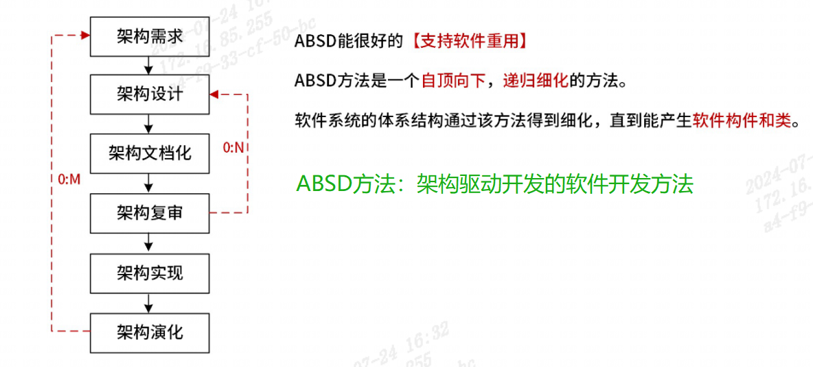
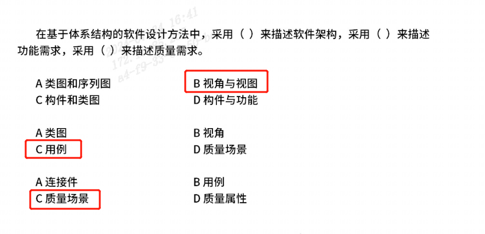
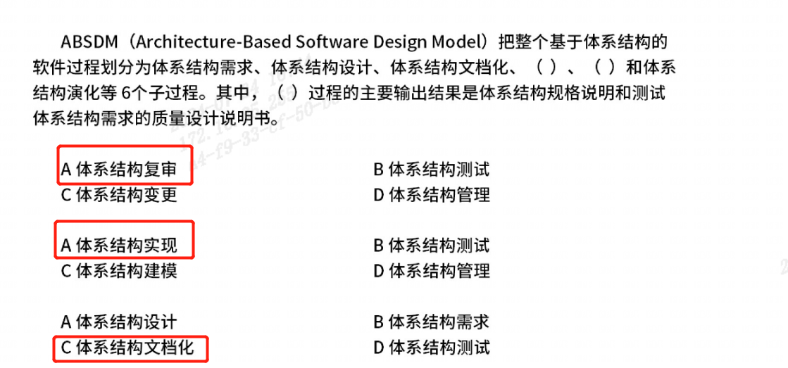

## 一、软件架构概念
### 机构本质
架构服务于软件设计，架构是软件设计在`结构、行为、属性`上的一个高级抽象。

### 机构作用
1、架构可以作为软件干系人之间的交流工具。    
2、软件架构是一种`可传递可复用`的模型，通过研究软件系统的架构来评估软件系统的质量。
3、软件架构使得软件设计在推理和修改变得更加简单，`可服务于循序渐进的原型设计`，可作为培训的工具。

## 二、架构发展历程
`主要认识一下【4+1软件架构视图】`  

## 三、架构描述语言【ADL】
构件：计算或数据存储单元。   
连接件：用于构件之间交互建模的体系结构构造块及其支配这些交互的规则。  
架构配置：描述体系结构的构件与连接件的连接图。  

### 四、基于架构的软件开发方法
#### 概念认识
架构更多的关注`非功能化的需求`    
#### 试题练习

简答：在基于体系结构的软件设计方法中，采用 **（B 视角与视图）** 来描述软件架构，采用 **（C 用例）** 来描述功能需求，采用 **（C 质量场景）** 来描述质量需求。   
视角与视图能够全面、系统地展现软件架构的各个方面；用例是常用于清晰描述软件功能需求的有效方式；质量场景则有助于明确和阐述软件的质量需求。

